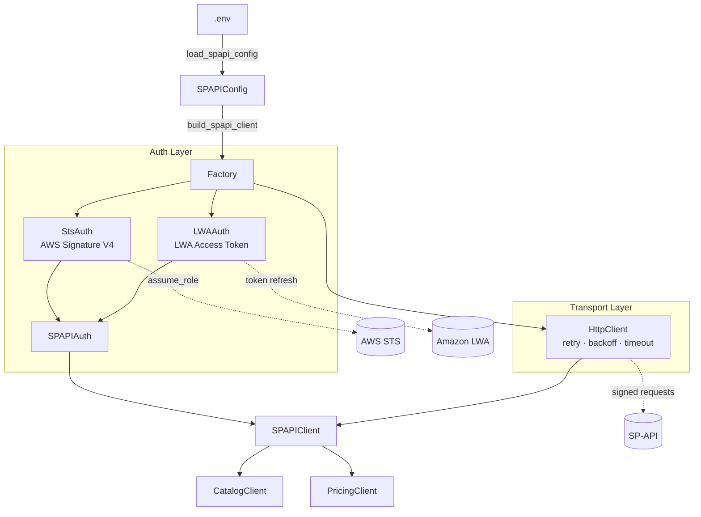

# MarketFit 🌍

**Compare your Amazon product across marketplaces — instantly.**

MarketFit is an open-source tool that helps Amazon sellers identify the most profitable marketplace for their products. Enter an ASIN, select marketplaces, and get a side-by-side comparison of price, competition, and reviews.

---

## Why MarketFit?

Selling on multiple Amazon marketplaces is complex. Prices vary, competition differs, and demand shifts across regions. MarketFit pulls real data via the Amazon SP-API to help sellers make informed expansion decisions — without manually checking each marketplace.

---

## Features

- 🔍 ASIN lookup across multiple Amazon marketplaces (US, CA, FR, DE, UK...)
- 📊 Side-by-side comparison : price, number of sellers, reviews, ratings
- 📈 Keepa price history chart integration _(coming soon)_
- ⚡ Built on real SP-API data — not scraping

---

## Tech Stack

- **Backend** : Python / FastAPI
- **Amazon** : SP-API Catalog Items API / Product Pricing API
- **Frontend** : React

---

## Architecture



> Solid arrows represent internal dependency injection. Dotted arrows represent external network calls.

---

## Getting Started

```bash
git clone https://github.com/bigbossHMZ/market-fit
cd market-fit
pip install -r requirements.txt
uvicorn main:app --reload
```

---

## Testing

```bash
source venv/bin/activate
cd apps/backend

# Run all tests
python -m pytest -v

# Run unit tests only
python -m pytest tests/unit/ -v

# Run integration tests only (requires Localstack)
python -m pytest tests/integration/ -v
```

---

## API Endpoints

| Method | Endpoint          | Description                                      |
| ------ | ----------------- | ------------------------------------------------ |
| GET    | `/health`         | Health check                                     |
| GET    | `/compare/{asin}` | Compare ASIN across marketplaces _(coming soon)_ |

---

## Status

🚧 Active development — contributions welcome.

---

## Author

Built by [Hichem Hamza](https://www.malt.fr/profile/hichemhamza) — Backend developer specialized in Amazon SP-API.
